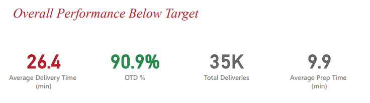
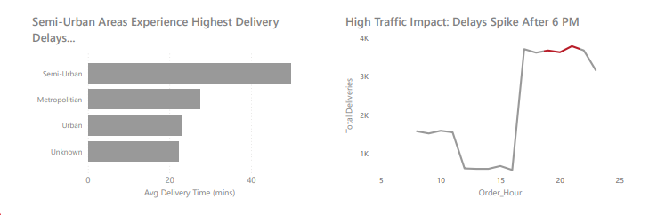
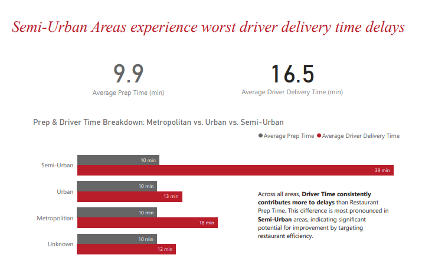
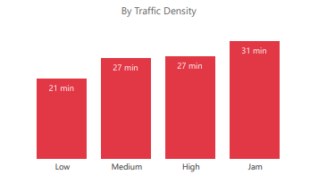
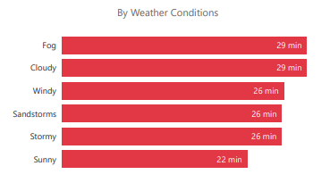
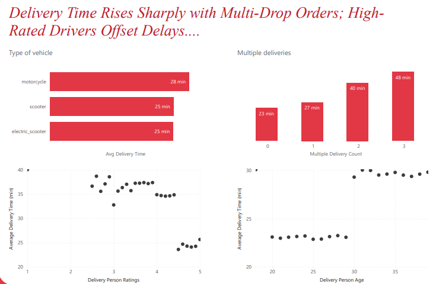
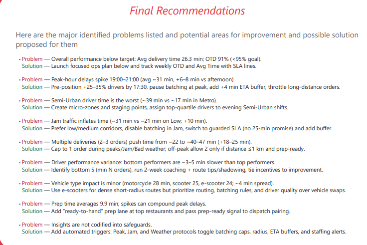

# Zomato Delivery Performance Analysis — Power BI Dashboard

---

## Project Overview

This project presents a comprehensive Power BI dashboard designed to analyze Zomato’s delivery operations.  
The objective is to identify bottlenecks in delivery performance, quantify delay drivers, understand external factors such as traffic and weather, and evaluate driver-level performance.

The dashboard is structured to enable smooth navigation through KPI summaries, bottleneck diagnostics, factor-driven analysis, and final recommendations.

---

## Download the Dashboard

You can download and open the full interactive Power BI dashboard here:

**[Download PBIX File](Dashboard/zomato_delivery.pbix)**  

---

# Data Lifecycle

The data lifecycle for this project followed a clear and structured approach entirely within **Power BI and Power Query**, covering every stage from raw data to actionable insights:

### **1. Data Ingestion**  
The dataset (CSV format) was imported directly into Power BI Desktop.  
Power Query acted as the primary interface for connecting, loading, and preparing the dataset.

### **2. Data Cleaning (Power Query)**  
Power Query was used to perform all data refinement steps, including:  
- Converting raw text-based time fields into datetime formats  
- Standardizing categorical labels (weather, area type, vehicle type)  
- Handling missing values through replacement or filtered removal  
- Removing duplicates and correcting inconsistencies  
- Fixing numeric and data-type formatting  
- Splitting, trimming, and merging columns as required  

These automated steps ensured a clean and accurate dataset ready for modeling.

### **3. Data Transformation (Power Query)**  
Additional derived fields were created to support the analysis:  
- Delivery Duration  
- Order Hour  
- Driver Segments  
- Traffic and Weather Categories  
- Multiple Delivery Counts  
- Area Classification Fields  

All transformations were documented within Power Query's "Applied Steps," ensuring traceability.

### **4. Data Modeling**  
A clean, model-ready table was loaded into Power BI.  
Key relationships, hierarchies, and relevant DAX measures (e.g., KPIs, averages, comparisons) were then built on top of the structured data.

### **5. Visualization & Insight Generation**  
Finally, the transformed data powered interactive visuals across multiple report pages, enabling thorough analysis of delay patterns, bottlenecks, and improvement opportunities.

---

## Key Insights and Outcomes

- Semi-Urban locations show the slowest delivery times, significantly higher than Metro and Urban regions.  
- Peak-hour delivery time (19:00–21:00) increases by 6–8 minutes, indicating a staffing and routing imbalance.  
- Jam traffic contributes nearly 10 minutes of additional delay on average.  
- Multiple parallel deliveries increase delivery time by 18–25 minutes.  
- Higher-rated drivers deliver faster, lowering operational delays.  
- Adverse weather such as fog and storms negatively affects delivery performance.

---

# Dashboard Sections and Explanation of Visuals

### 1. KPI Highlights  

The KPI overview provides essential metrics such as average delivery time, preparation time, on-time delivery rate, and total orders.  
This section sets the context for operational performance at a high level.

---

### 2. Area-wise Delivery Time Comparison  

This visual compares delivery duration across Metro, Urban, Semi-Urban, and Unknown areas.  
Semi-Urban locations exhibit the longest delivery times, influenced by distance and infrastructural constraints.

---

### 3. Preparation Time vs Driver Time Breakdown  

This analysis separates the two primary components of delivery time:  
- Restaurant preparation time  
- Driver travel time  

Driver time is consistently the larger contributor, especially in Semi-Urban areas.

---

### 4. Traffic Impact Analysis  

Delivery duration is examined across different traffic density levels.  
Jam traffic results in the highest delays, indicating a strong correlation between traffic congestion and operational efficiency.

---

### 5. Weather Condition Analysis  

This visual breaks down delivery performance under different weather conditions.  
Fog, storms, and cloudy weather show a noticeable impact on delivery times, highlighting the need for dynamic ETA adjustments.

---

### 6. Driver Performance Analysis  

This section evaluates several driver-level variables including:  
- Age  
- Vehicle type  
- Delivery batching (multiple simultaneous orders)  
- Driver rating  

Higher driver ratings lead to faster deliveries, and multi-drop orders significantly increase total delivery duration.

---

### 7. Recommendations  

The final page consolidates key operational issues and provides actionable recommendations, such as:  
- Peak-hour staffing adjustment  
- Restricting batching under heavy traffic or bad weather  
- Optimizing routing for Semi-Urban areas  
- Targeted driver coaching for bottom performers  
- Improving coordination of restaurant preparation and dispatch

---

# How to Use the Dashboard

1. Download the PBIX file [from here](Dashboard/zomato_delivery.pbix)
2. Open the file using Power BI Desktop.  
3. Go to **Transform Data → Data Source Settings** and update the file path for the dataset if necessary.  
4. Refresh the report to load all data.  
5. Use the Home page navigation buttons to explore each section of the analysis.

